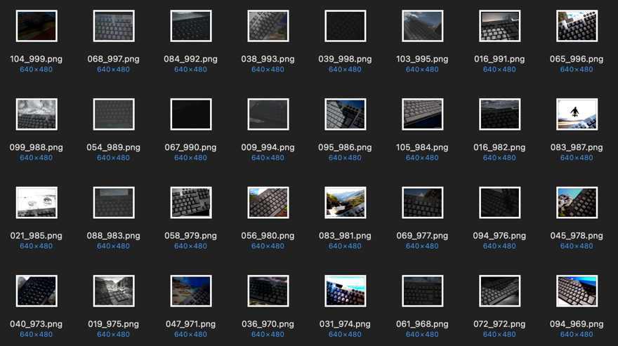

# Keyboard Key Detection

This project aims to create an ML pipeline to generate synthetic training images using Blender, create realistic data augmentation, and fine-tune various image segmentation models.

The goal of the models is to detect:
1. the location of keys (key regions) on a keyboard
2. the letter/symbol they correspond to

## Dataset Generation

A Blender file with a 3D modelled keyboard and camera is provided in [keyboard.blend](blender/keyboard.blend). 

First, [setup_viewpoints.py](blender/setup_viewpoints.py) places the camera along the vertices of the Viewpoints object and orients it to face the keyboard. The camera's position and rotation is randomly perturbed at each keyframe. To define additional viewpoints, edit the Viewpoints object.

Next, [segmentation_mask.py](blender/segmentation_mask.py) provides a script to automatically assign flat colors to each key's face. Set `SET_MASK = True` to create the segmentation masks, or `SET_MASK = False` to revert back. 

To find key faces, the program iterates through each face in the 'Keys' collection and checks if its dot product with the orientation vector (the normal of the 'Orientation' object) is small.
 

Then, using [render.py](blender/render.py), sky lightning conditions are configured and several keyboard angles are rendered using Cycles. Masks are rendered using Eevee.

Finally, the image is imported into Python and the process in [data-augmentation.ipynb](data-augmentation.ipynb) is followed. A random background is chosen from a dataset of 4000 landscapes.

[//]: # (TODO Shadows)

Then, a motion blur along a random direction (0° to 360°) + random kernel size (4-16) is applied along with a vignette of random strength.

Finally, contrast, exposure, sharpness, saturation are sampled from a Gaussian distribution (μ=1, σ=0.5), clamped, and applied to the image.

To speed up dataset creation, a multiprocessing pipeline is defined in [create_dataset.py](datasets/create_dataset.py)

